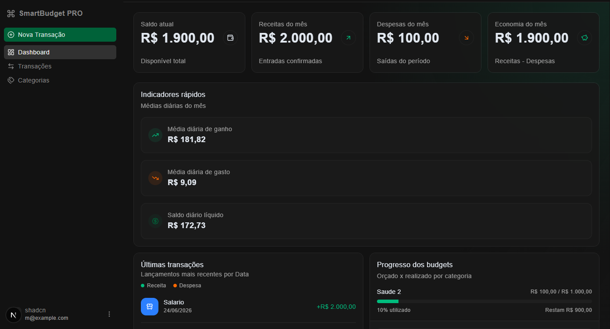
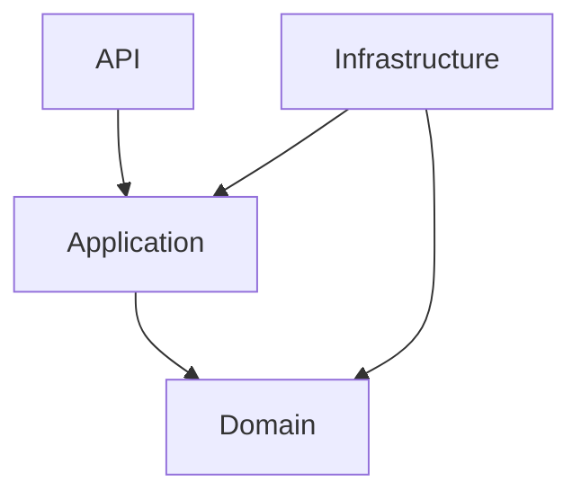

# SmartBudget

[PT-BR version](README.pt-BR.md)

SmartBudget is a full-stack personal finance project under active development, created as a practical exercise to strengthen software architecture, domain modeling, and modern web development skills.

## Overview

The project combines a .NET 10 API with a Next.js 15 web interface to manage users, categories, financial transactions, monthly budgets, and analytics dashboards. Development is incremental, with a strong focus on code quality, Clean Architecture, and scalable product decisions.

## Status

Actively in development.

## Project Preview



## Stack

- Backend: C#, .NET 10, ASP.NET Core, Entity Framework Core, Clean Architecture, FluentValidation, JWT
- Frontend: Next.js 15, React, TypeScript, Tailwind CSS, shadcn/ui, React Query, React Hook Form, Zod, next-nprogress-bar
- Database: PostgreSQL (Neon)
- CI: GitHub Actions

## Implemented Features

- Complete JWT authentication (login, register, logout)
- Protected routes with AuthGuard and GuestGuard
- Per-user CRUD for transaction categories
- CRUD for financial transactions (income, expense, transfer) with monthly recurrence support
- Monthly budget per category with automatic recalculation and status (Ok, Warning, Exceeded)
- Dashboard with KPIs, income vs expense charts, category distribution, balance evolution, and budget progress
- Customizable dashboard: users can reorder, hide, and resize components
- Server-side cache with per-user tags
- Multi-user support
- CI pipeline with GitHub Actions (frontend lint/build and backend build)

## Backend Architecture



## Repository Structure

- backend: API, application, domain, and infrastructure
- frontend: web application
- exercice.en.md and exercice.pt.md: exercise context and requirements

## Running Locally

### Backend

```bash
cd backend/src/SmartBudgetPro.API
dotnet restore
dotnet run
```

### Frontend

```bash
cd frontend
npm install
npm run dev
```

## Next Steps

- Implement automatic monthly recurrence job
- Add Financial Risk feature (alert when fixed expenses exceed 70% of income)
- Add unit tests
- Prepare and execute deployment

## Project Goal

This repository was created for applied learning while following a real product direction. The goal is to continuously evolve SmartBudget while practicing technical decisions that matter in professional software projects.
