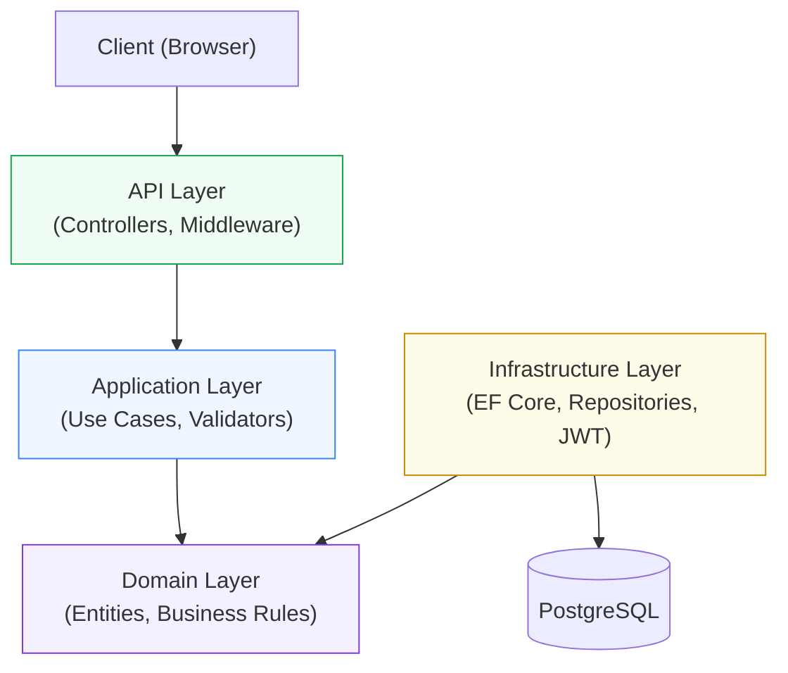

# SmartBudget

> A full-stack personal finance management application built with .NET 10 and Next.js 15.

[](https://github.com/DevSamuelBrito/SmartBudget/actions/workflows/ci.yml)
[](https://sonarcloud.io/summary/new_code?id=DevSamuelBrito_SmartBudget)
[](https://snyk.io/test/github/DevSamuelBrito/SmartBudget)


[🇧🇷 Leia em Português](./README.pt-BR.md)

---

## About

SmartBudget is a personal finance tracker that helps users take control of their money. It offers transaction management, customizable budget limits, a rich dashboard with visual insights, and a category system — all secured by JWT authentication and available in multiple languages.

### Features

- **Authentication** — Secure registration and login with JWT stored in HttpOnly cookies
- **Transactions** — Create, edit, delete, and filter income and expense transactions
- **Categories** — Fully customizable categories with icons, colors, and drag-and-drop ordering
- **Budgets** — Monthly budget limits per category with real-time spending indicators
- **Dashboard** — Charts and summaries for income, expenses, balance, and category breakdown
- **Premium plans** — Subscription tier system to unlock advanced features
- **Internationalization** — Full UI translation in English and Brazilian Portuguese (pt-BR)

---

## Tech Stack

### Backend

| Technology | Purpose |
|---|---|
| .NET 10 / C# | Runtime and language |
| ASP.NET Core | REST API framework |
| Entity Framework Core | ORM |
| PostgreSQL (Neon) | Primary database |
| Clean Architecture | Layered domain design |
| FluentValidation | Input validation |
| JWT | Authentication tokens |
| xUnit + Moq + FluentAssertions | Unit testing |

### Frontend

| Technology | Purpose |
|---|---|
| Next.js 15 / React 19 | UI framework (App Router) |
| TypeScript (strict) | Type safety |
| Tailwind CSS 4 | Styling |
| shadcn/ui | Component library |
| TanStack React Query | Server state management |
| React Hook Form + Zod | Form handling and validation |
| Axios | HTTP client |
| Recharts | Data visualization |
| Playwright | End-to-end testing |
| Jest + React Testing Library | Unit testing |

### DevOps

| Tool | Purpose |
|---|---|
| Docker + Docker Compose | Containerized local environment |
| GitHub Actions | CI pipeline (lint, build, test) |
| SonarCloud | Code quality and coverage analysis |
| Snyk | Dependency vulnerability scanning |
| CodeRabbit | Automated PR code review |

---

## Architecture

The backend follows Clean Architecture with strict dependency rules — outer layers depend on inner layers, never the reverse.



---

## Architecture & Design Patterns

### Architectural Patterns

- **Clean Architecture** — strict layer separation (Domain, Application, Infrastructure, API) with dependencies pointing inward
- **Repository Pattern** — database access abstracted behind interfaces, keeping the domain free of persistence concerns
- **Use Case Pattern** — one class per business operation, enforcing Single Responsibility Principle across all features

### Domain Design

- **Rich Domain Model** — business rules and invariants encapsulated inside entities, not leaked into services
- **Factory Methods** — controlled object creation via static `Entity.Create(...)` methods (e.g., `Budget.Create`, `User.Create`)
- **Domain Exceptions** — business rule violations expressed as typed exceptions (`BusinessException` hierarchy), mapped to HTTP responses by middleware

### API Design

- **RESTful API** — resource-based endpoints following proper HTTP semantics (verbs, status codes, resource nesting)
- **ProblemDetails (RFC 7807)** — standardized JSON error responses across all failure cases
- **JWT Authentication** — stateless authentication with tokens stored in HttpOnly cookies to prevent XSS access

### Frontend Patterns

- **Server Components + Client Components** — hybrid rendering strategy: data fetching on the server, interactivity isolated to client components
- **Server Actions** — type-safe server mutations for form submissions without a separate API route
- **Optimistic Cache Invalidation** — React Query with user-scoped cache tags for immediate UI feedback on mutations

### Resilience & Security

- **Global Exception Middleware** — centralized error handling (`ExceptionHandlingMiddleware`) translating exceptions to consistent HTTP responses
- **Multi-layer Validation** — FluentValidation on the backend and Zod on the frontend ensure data integrity at every boundary
- **Premium Feature Guards** — subscription-tier checks enforced on both the backend (authorization) and frontend (UI restrictions)

---

## Getting Started (Quick — Docker)

Get the project running in five commands:

```bash
git clone https://github.com/DevSamuelBrito/SmartBudget.git
cd SmartBudget
cp .env.example .env
# Edit .env and fill in your PostgreSQL connection string
docker compose up --build
```

Open [http://localhost:3000](http://localhost:3000). The API runs on port `8080`.

---

## Running Locally (Without Docker)

### Prerequisites

- [.NET 10 SDK](https://dotnet.microsoft.com/download)
- [Node.js 24+](https://nodejs.org/)
- A PostgreSQL database (local or [Neon](https://neon.tech))

### Backend

1. Create `backend/src/SmartBudgetPro.API/appsettings.Development.json`:

```json
{
  "ConnectionStrings": {
    "DefaultConnection": "Host=localhost;Port=5432;Database=SmartBudget;Username=postgres;Password=yourpassword"
  },
  "JwtSettings": {
    "SecretKey": "your-secret-key-at-least-32-characters",
    "Issuer": "SmartBudgetPro",
    "Audience": "SmartBudgetPro",
    "ExpirationMinutes": 60
  }
}
```

2. Run the API:

```bash
cd backend
dotnet run --project src/SmartBudgetPro.API
```

The API will be available at `http://localhost:8080`.

### Frontend

1. Create `frontend/.env.local`:

```env
NEXT_PUBLIC_API_URL=http://localhost:8080/api/v1/
API_URL=http://localhost:8080/api/v1/
```

2. Install dependencies and start the dev server:

```bash
cd frontend
npm install
npm run dev
```

The app will be available at `http://localhost:3000`.

---

## Running with Docker

The Docker setup runs backend and frontend. It requires an external PostgreSQL connection (e.g., [Neon](https://neon.tech)).

1. Copy the environment template:

```bash
cp .env.example .env
```

2. Fill in the required values in `.env` (see [Environment Variables](#environment-variables) below).

3. Build and start all services:

```bash
docker compose up --build
```

---

## Environment Variables

### `.env` (Docker — project root)

| Variable | Description | Example |
|---|---|---|
| `ConnectionStrings__DefaultConnection` | PostgreSQL connection string for the backend | `Host=...;Database=SmartBudget;...` |
| `NEXT_PUBLIC_API_URL` | Public API URL used in the browser | `http://localhost:8080/api/v1/` |
| `API_URL` | Internal API URL used by Next.js server-side | `http://backend:8080/api/v1/` |

See `.env.example` for a ready-to-copy template.

### `frontend/.env.local` (local development)

| Variable | Description | Example |
|---|---|---|
| `NEXT_PUBLIC_API_URL` | Public API URL for browser requests | `http://localhost:8080/api/v1/` |
| `API_URL` | Server-side API URL for Next.js | `http://localhost:8080/api/v1/` |

### `frontend/.env.test` (E2E tests)

| Variable | Description | Example |
|---|---|---|
| `E2E_EMAIL` | Test account email used by Playwright | `test@example.com` |
| `E2E_PASSWORD` | Test account password used by Playwright | `Test@123` |

### `backend/src/SmartBudgetPro.API/appsettings.Development.json` (local development)

| Key | Description |
|---|---|
| `ConnectionStrings:DefaultConnection` | PostgreSQL connection string |
| `JwtSettings:SecretKey` | Secret key for signing JWT tokens (min. 32 chars) |
| `JwtSettings:Issuer` | JWT issuer identifier |
| `JwtSettings:Audience` | JWT audience identifier |
| `JwtSettings:ExpirationMinutes` | Token lifetime in minutes |

---

## Running Tests

### Backend (unit tests)

```bash
cd backend
dotnet test
```

With coverage:

```bash
dotnet test /p:CollectCoverage=true
```

### Frontend (unit tests)

```bash
cd frontend
npm test
```

With coverage:

```bash
npm test -- --coverage
```

### Frontend (E2E tests)

E2E tests require both the backend and frontend to be running.

```bash
# Terminal 1 — start the backend
cd backend && dotnet run --project src/SmartBudgetPro.API

# Terminal 2 — start the frontend
cd frontend && npm run dev

# Terminal 3 — run E2E tests
cd frontend
npm run test:e2e
```

---

## Repository Structure

```
SmartBudget/
├── backend/
│   ├── src/
│   │   ├── SmartBudgetPro.API/            # Controllers, middleware, DI config
│   │   ├── SmartBudgetPro.Application/    # Use cases, validators, interfaces
│   │   ├── SmartBudgetPro.Domain/         # Entities, business rules
│   │   ├── SmartBudgetPro.Infrastructure/ # EF Core, repositories, JWT
│   │   └── SmartBudgetPro.Shared/         # Shared utilities
│   └── tests/
│       └── SmartBudgetPro.Tests/          # xUnit unit tests
├── frontend/                              # Next.js 15 App Router
│   ├── app/                              # Pages and layouts
│   ├── components/                       # UI and domain components
│   ├── hooks/                            # Custom React hooks
│   ├── e2e/                              # Playwright E2E tests
│   └── __tests__/                        # Unit tests
├── docs/
│   └── screenshots/                      # App screenshots
├── .env.example                          # Environment variable template
└── docker-compose.yml
```

---

## Screenshots

> Screenshots will be added here. Place images in `docs/screenshots/`.


---

## Contributing

Contributions are welcome. The project follows a simple branch strategy:

| Branch | Purpose |
|---|---|
| `main` | Stable, production-ready code |
| `develop` | Integration branch for ongoing work |
| `feature/*` | New features branched from `develop` |
| `fix/*` | Bug fixes branched from `develop` |

**Workflow:**

1. Fork the repository and create your branch from `develop`
2. Make your changes with clear, focused commits
3. Open a pull request targeting `develop`
4. Pass CI checks — PRs are reviewed automatically by CodeRabbit

---

## License

This project is licensed under the [MIT License](./LICENSE).
