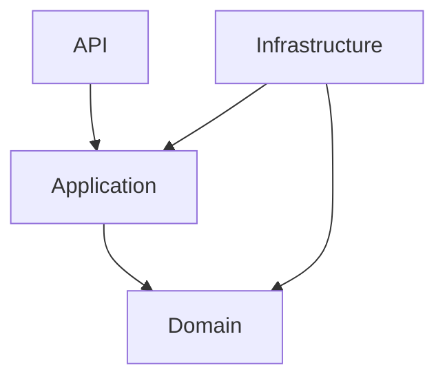

# SmartBudget

[English version](README.md)

SmartBudget e um projeto full stack de financas pessoais em desenvolvimento ativo, criado como exercicio pratico para consolidar conhecimentos em arquitetura de software, modelagem de dominio e desenvolvimento web moderno.

## Visao Geral

O projeto combina uma API em .NET 10 com uma interface web em Next.js 15 para gerenciar usuarios, categorias, transacoes financeiras, orcamentos mensais e dashboards analiticos. A evolucao acontece de forma incremental, com foco em qualidade de codigo, Clean Architecture e decisoes de produto escalaveis.

## Status

Em desenvolvimento ativo.

## Stack

- Backend: C#, .NET 10, ASP.NET Core, Entity Framework Core, Clean Architecture, FluentValidation, JWT
- Frontend: Next.js 15, React, TypeScript, Tailwind CSS, shadcn/ui, React Query, React Hook Form, Zod, next-nprogress-bar
- Banco de dados: PostgreSQL (Neon)
- CI: GitHub Actions

## Funcionalidades Implementadas

- Autenticacao completa com JWT (login, registro, logout)
- Rotas protegidas com AuthGuard e GuestGuard
- CRUD de categorias por usuario
- CRUD de transacoes financeiras (receita, despesa, transferencia) com suporte a recorrencia mensal
- Budget mensal por categoria com recalculo automatico e status (Ok, Warning, Exceeded)
- Dashboard com KPIs, graficos de receitas vs despesas, distribuicao por categoria, evolucao de saldo e progresso de budgets
- Dashboard customizavel: usuario pode reordenar, ocultar e redimensionar componentes
- Cache server-side com tags por usuario
- Suporte multi-usuario
- Pipeline de CI com GitHub Actions (lint/build do frontend e build do backend)

## Arquitetura do Backend



## Estrutura do Repositorio

- backend: API, aplicacao, dominio e infraestrutura
- frontend: aplicacao web
- exercice.en.md e exercice.pt.md: contexto e requisitos do exercicio

## Como Rodar Localmente

### Backend

```bash
cd backend/src/SmartBudgetPro.API
dotnet restore
dotnet run
```

### Frontend

```bash
cd frontend
npm install
npm run dev
```

## Proximos Passos

- Implementar job de recorrencia mensal automatica
- Adicionar funcionalidade Financial Risk (alerta quando gasto fixo exceder 70% da renda)
- Adicionar testes unitarios
- Preparar e executar deploy

## Objetivo do Projeto

Este repositorio foi criado para aprendizado aplicado, mas com direcao de produto real. A ideia e evoluir continuamente o SmartBudget enquanto pratico decisoes tecnicas relevantes para projetos profissionais.
