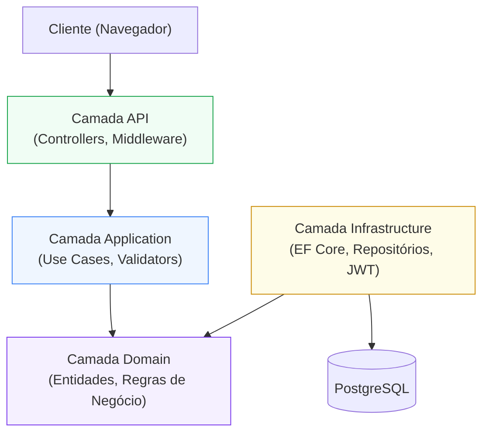
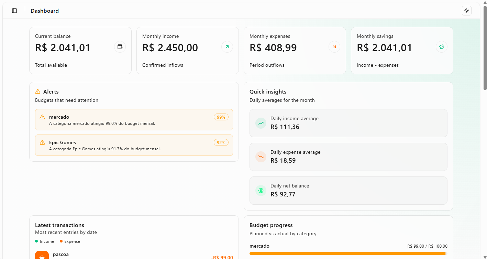
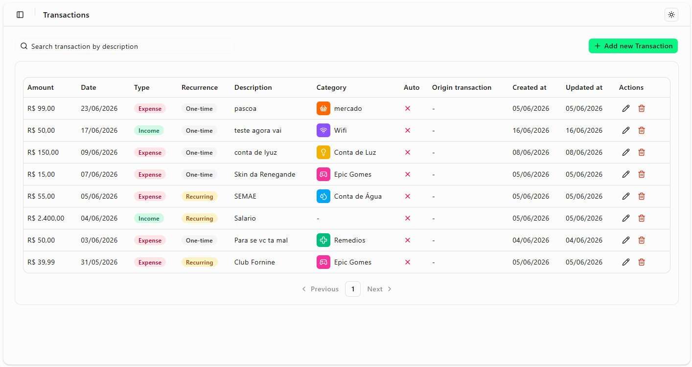
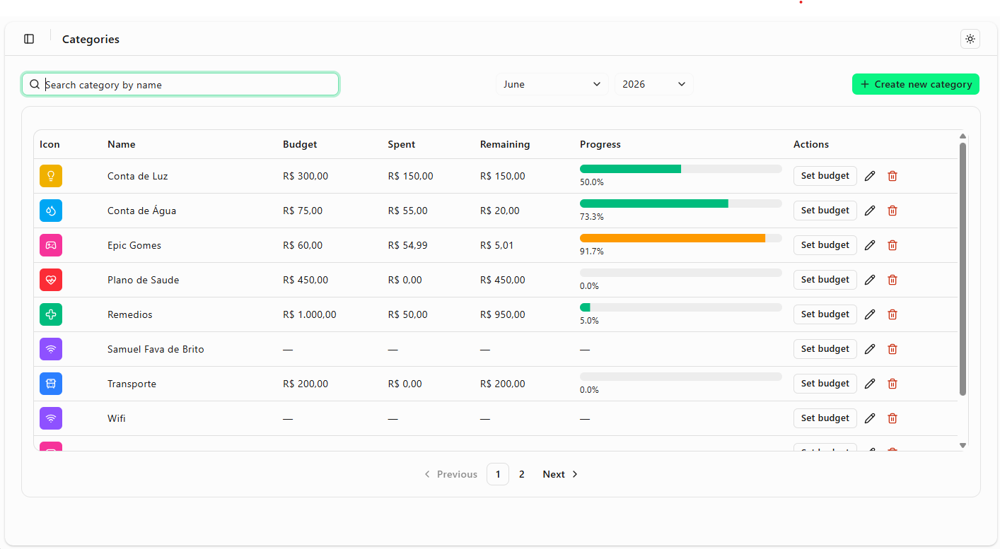
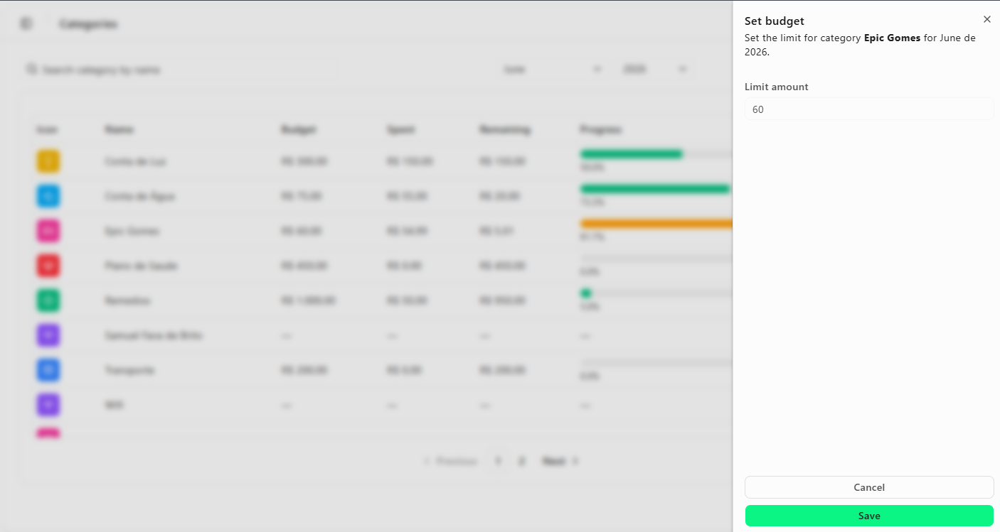

# SmartBudget

> Aplicação full-stack de controle financeiro pessoal construída com .NET 10 e Next.js 15.

[](https://github.com/DevSamuelBrito/SmartBudget/actions/workflows/ci.yml)
[](https://sonarcloud.io/summary/new_code?id=DevSamuelBrito_SmartBudget)
[](https://snyk.io/test/github/DevSamuelBrito/SmartBudget)


[🇺🇸 Read in English](./README.md)

---

## Sobre o projeto

SmartBudget é um sistema de controle financeiro pessoal que ajuda usuários a organizarem suas finanças. Oferece gerenciamento de transações, limites de orçamento por categoria, um dashboard rico com gráficos e resumos, tudo protegido por autenticação JWT e disponível em múltiplos idiomas.

### Funcionalidades

- **Autenticação** — Cadastro e login seguros com JWT armazenado em cookies HttpOnly
- **Transações** — Criação, edição, exclusão e filtro de receitas e despesas
- **Categorias** — Categorias personalizáveis com ícones, cores e ordenação por drag-and-drop
- **Orçamentos** — Limites mensais por categoria com indicadores de gasto em tempo real
- **Dashboard** — Gráficos e resumos de receitas, despesas, saldo e distribuição por categoria
- **Planos premium** — Sistema de assinatura para desbloquear funcionalidades avançadas
- **Internacionalização** — Interface totalmente traduzida em inglês e português (pt-BR)

---

## Stack Tecnológica

### Backend

| Tecnologia | Uso |
|---|---|
| .NET 10 / C# | Runtime e linguagem |
| ASP.NET Core | Framework REST API |
| Entity Framework Core | ORM |
| PostgreSQL (Neon) | Banco de dados principal |
| Clean Architecture | Arquitetura em camadas |
| FluentValidation | Validação de entradas |
| JWT | Tokens de autenticação |
| xUnit + Moq + FluentAssertions | Testes unitários |
| Brevo | Serviço de e-mail transacional (recuperação de senha) |

### Frontend

| Tecnologia | Uso |
|---|---|
| Next.js 15 / React 19 | Framework de UI (App Router) |
| TypeScript (strict) | Tipagem estática |
| Tailwind CSS 4 | Estilização |
| shadcn/ui | Biblioteca de componentes |
| TanStack React Query | Gerenciamento de estado servidor |
| React Hook Form + Zod | Formulários e validação |
| Axios | Cliente HTTP |
| Recharts | Visualização de dados |
| Playwright | Testes end-to-end |
| Jest + React Testing Library | Testes unitários |

### DevOps

| Ferramenta | Uso |
|---|---|
| Docker + Docker Compose | Ambiente local containerizado |
| GitHub Actions | Pipeline de CI (lint, build, testes) |
| SonarCloud | Qualidade de código e cobertura |
| Snyk | Varredura de vulnerabilidades em dependências |
| CodeRabbit | Code review automático em PRs |

---

## Arquitetura

O backend segue Clean Architecture com regras de dependência estritas — camadas externas dependem das internas, nunca o contrário.



---

## Arquitetura & Padrões de Design

### Padrões Arquiteturais

- **Clean Architecture** — separação estrita de camadas (Domain, Application, Infrastructure, API) com dependências apontando para dentro
- **Repository Pattern** — acesso ao banco abstraído por interfaces, mantendo o domínio livre de preocupações de persistência
- **Use Case Pattern** — uma classe por operação de negócio, aplicando o Princípio da Responsabilidade Única em todas as features

### Design de Domínio

- **Rich Domain Model** — regras de negócio e invariantes encapsulados nas entidades, sem vazar para serviços
- **Factory Methods** — criação controlada de objetos via métodos estáticos `Entity.Create(...)` (ex.: `Budget.Create`, `User.Create`)
- **Domain Exceptions** — violações de regras de negócio expressas como exceções tipadas (hierarquia `BusinessException`), mapeadas para respostas HTTP pelo middleware

### Design de API

- **RESTful API** — endpoints baseados em recursos seguindo semântica HTTP correta (verbos, status codes, aninhamento de recursos)
- **ProblemDetails (RFC 7807)** — respostas de erro JSON padronizadas em todos os casos de falha
- **JWT Authentication** — autenticação stateless com tokens armazenados em cookies HttpOnly para prevenir acesso via XSS

### Padrões de Frontend

- **Server Components + Client Components** — estratégia de renderização híbrida: busca de dados no servidor, interatividade isolada em client components
- **Server Actions** — mutações server-side com tipagem segura para envio de formulários sem rota de API separada
- **Optimistic Cache Invalidation** — React Query com cache tags por usuário para feedback imediato na UI após mutações

### Resiliência & Segurança

- **Global Exception Middleware** — tratamento centralizado de erros (`ExceptionHandlingMiddleware`) traduzindo exceções em respostas HTTP consistentes
- **Validação em Múltiplas Camadas** — FluentValidation no backend e Zod no frontend garantem integridade dos dados em toda fronteira
- **Premium Feature Guards** — verificações de tier de assinatura aplicadas no backend (autorização) e no frontend (restrições de UI)

---

## Início Rápido (Docker)

Coloque o projeto no ar com cinco comandos:

```bash
git clone https://github.com/DevSamuelBrito/SmartBudget.git
cd SmartBudget
cp .env.example .env
# Edite o .env e preencha a connection string do PostgreSQL
docker compose up --build
```

Acesse [http://localhost:3000](http://localhost:3000). A API roda na porta `8080`.

---

## Rodando Localmente (Sem Docker)

### Pré-requisitos

- [.NET 10 SDK](https://dotnet.microsoft.com/download)
- [Node.js 24+](https://nodejs.org/)
- Um banco de dados PostgreSQL (local ou [Neon](https://neon.tech))

### Backend

1. Crie o arquivo `backend/src/SmartBudgetPro.API/appsettings.Development.json`:

```json
{
  "ConnectionStrings": {
    "DefaultConnection": "Host=localhost;Port=5432;Database=SmartBudget;Username=postgres;Password=suasenha"
  },
  "JwtSettings": {
    "SecretKey": "sua-chave-secreta-com-pelo-menos-32-caracteres",
    "Issuer": "SmartBudgetPro",
    "Audience": "SmartBudgetPro",
    "ExpirationMinutes": 60
  }
}
```

2. Execute a API:

```bash
cd backend
dotnet run --project src/SmartBudgetPro.API
```

A API estará disponível em `http://localhost:8080`.

### Frontend

1. Crie o arquivo `frontend/.env.local`:

```env
NEXT_PUBLIC_API_URL=http://localhost:8080/api/v1/
API_URL=http://localhost:8080/api/v1/
```

2. Instale as dependências e inicie o servidor de desenvolvimento:

```bash
cd frontend
npm install
npm run dev
```

A aplicação estará disponível em `http://localhost:3000`.

---

## Rodando com Docker

O Docker executa o backend e o frontend. É necessária uma conexão externa ao PostgreSQL (ex.: [Neon](https://neon.tech)).

1. Copie o template de variáveis de ambiente:

```bash
cp .env.example .env
```

2. Preencha os valores no `.env` (veja [Variáveis de Ambiente](#variáveis-de-ambiente) abaixo).

3. Faça o build e suba os serviços:

```bash
docker compose up --build
```

---

## Variáveis de Ambiente

### `.env` (Docker — raiz do projeto)

| Variável | Descrição | Exemplo |
|---|---|---|
| `ConnectionStrings__DefaultConnection` | String de conexão do PostgreSQL para o backend | `Host=...;Database=SmartBudget;...` |
| `NEXT_PUBLIC_API_URL` | URL pública da API usada no navegador | `http://localhost:8080/api/v1/` |
| `API_URL` | URL interna da API usada pelo Next.js no servidor | `http://backend:8080/api/v1/` |

Consulte o `.env.example` para um template pronto para copiar.

### `frontend/.env.local` (desenvolvimento local)

| Variável | Descrição | Exemplo |
|---|---|---|
| `NEXT_PUBLIC_API_URL` | URL da API para requisições do navegador | `http://localhost:8080/api/v1/` |
| `API_URL` | URL da API para o lado servidor do Next.js | `http://localhost:8080/api/v1/` |

### `frontend/.env.test` (testes E2E)

| Variável | Descrição | Exemplo |
|---|---|---|
| `E2E_EMAIL` | E-mail da conta de teste usada pelo Playwright | `test@example.com` |
| `E2E_PASSWORD` | Senha da conta de teste usada pelo Playwright | `Test@123` |

### `backend/src/SmartBudgetPro.API/appsettings.Development.json` (desenvolvimento local)

| Chave | Descrição |
|---|---|
| `ConnectionStrings:DefaultConnection` | String de conexão do PostgreSQL |
| `JwtSettings:SecretKey` | Chave secreta para assinar tokens JWT (mín. 32 caracteres) |
| `JwtSettings:Issuer` | Identificador do emissor do JWT |
| `JwtSettings:Audience` | Identificador da audiência do JWT |
| `JwtSettings:ExpirationMinutes` | Tempo de vida do token em minutos |
| `Email:ApiKey` | Chave de API do Brevo para envio de e-mails |
| `Email:FromEmail` | E-mail remetente validado no Brevo |
| `FrontendUrl` | URL do frontend para geração do link de reset de senha |

---

## Executando os Testes

### Backend (testes unitários)

```bash
cd backend
dotnet test
```

Com cobertura:

```bash
dotnet test /p:CollectCoverage=true
```

### Frontend (testes unitários)

```bash
cd frontend
npm test
```

Com cobertura:

```bash
npm test -- --coverage
```

### Frontend (testes E2E)

Os testes E2E exigem que o backend e o frontend estejam em execução.

```bash
# Terminal 1 — inicia o backend
cd backend && dotnet run --project src/SmartBudgetPro.API

# Terminal 2 — inicia o frontend
cd frontend && npm run dev

# Terminal 3 — executa os testes E2E
cd frontend
npm run test:e2e
```

---

## Estrutura do Repositório

```
SmartBudget/
├── backend/
│   ├── src/
│   │   ├── SmartBudgetPro.API/            # Controllers, middleware, configuração de DI
│   │   ├── SmartBudgetPro.Application/    # Use cases, validators, interfaces
│   │   ├── SmartBudgetPro.Domain/         # Entidades, regras de negócio
│   │   ├── SmartBudgetPro.Infrastructure/ # EF Core, repositórios, JWT
│   │   └── SmartBudgetPro.Shared/         # Utilitários compartilhados
│   └── tests/
│       └── SmartBudgetPro.Tests/          # Testes unitários com xUnit
├── frontend/                              # Next.js 15 App Router
│   ├── app/                              # Páginas e layouts
│   ├── components/                       # Componentes de UI e domínio
│   ├── hooks/                            # Custom React hooks
│   ├── e2e/                              # Testes E2E com Playwright
│   └── __tests__/                        # Testes unitários
├── docs/
│   └── screenshots/                      # Capturas de tela da aplicação
├── .env.example                          # Template de variáveis de ambiente
└── docker-compose.yml
```

---

## Screenshots






---

## Contribuindo

Contribuições são bem-vindas. O projeto segue uma estratégia simples de branches:

| Branch | Finalidade |
|---|---|
| `main` | Código estável, pronto para produção |
| `develop` | Branch de integração do trabalho em andamento |
| `feature/*` | Novas funcionalidades criadas a partir de `develop` |
| `fix/*` | Correções de bugs criadas a partir de `develop` |

**Fluxo de trabalho:**

1. Faça um fork do repositório e crie sua branch a partir de `develop`
2. Faça suas alterações com commits claros e focados
3. Abra um pull request com destino para `develop`
4. Passe nas verificações de CI — os PRs são revisados automaticamente pelo CodeRabbit

---

## Licença

Este projeto está licenciado sob a [Licença MIT](./LICENSE).
